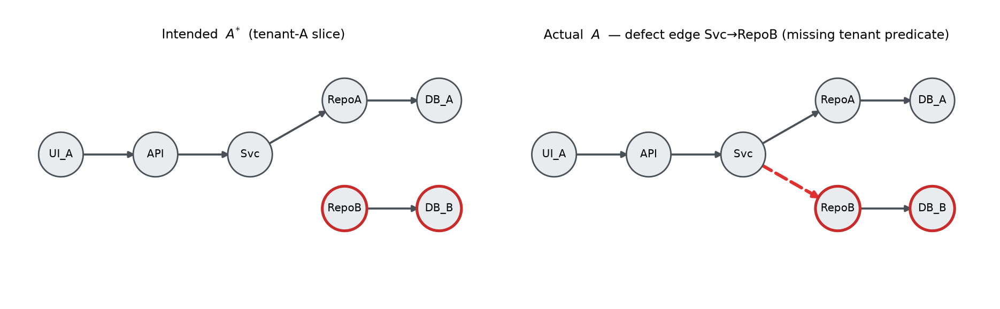
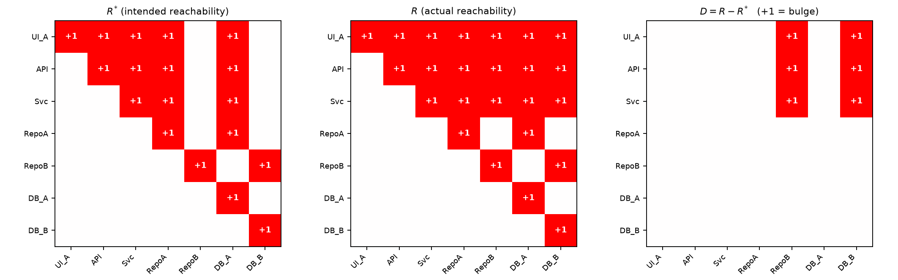
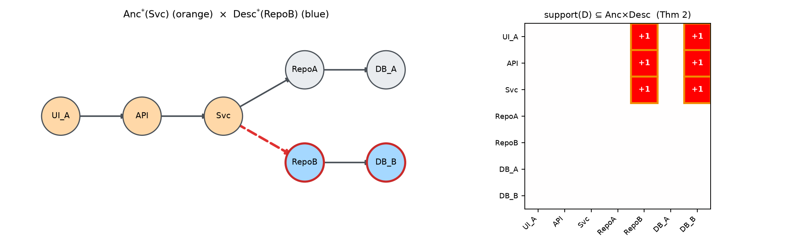
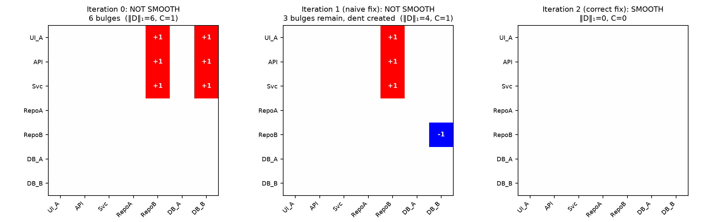

# Flow Surface Theory: A Formal Treatment

**Deformation matrices, blast-radius localization, and the smoothness loop as monotone descent**

*Companion to the flow-surface plugin marketplace. Every number in this document is
produced by `verify.py`; run it to reproduce all matrices, theorem checks, and figures.*

---

## Abstract

Flow Surface Theory (FST) models a software system's communication boundaries as a
surface and classifies defects by geometry: a **dent** is a flow that terminates before
its intended terminus (a bug); a **bulge** is a flow that extends beyond its intended
boundary (a vulnerability). This document gives the discrete formal core of that model.
We define a **deformation matrix** $D = R - R^{*}$, the difference between actual and
intended reachability, and prove four theorems: (1) a **polarity theorem** — edge
additions can create only bulges and edge deletions only dents, grounding the
dent/bulge asymmetry as a theorem rather than a slogan; (2) a **localization theorem**
— the deformation caused by one edge change is confined to
$\mathrm{Anc}(u) \times \mathrm{Desc}(v)$, making blast radius a computable quantity;
(3) a **fix-deformation theorem** characterizing exactly when removing a bulge creates
a dent, which makes the review question "did the fix move the discontinuity?"
decidable; and (4) a **cut-count theorem** connecting compartment isolation to graph
Laplacian energy. A worked seven-node multi-tenant example exercises every theorem
with deterministic matrices, including a numerically verified instance of a fix that
reduces total deformation while still moving the discontinuity. We position the
underlying flow machinery within fifty years of prior art (Denning's lattice model,
non-interference, program slicing, abstract interpretation) and state honestly which
parts of FST are formal and which are operational engineering.

---

## 1. Preliminaries

**Definition 1 (System graph).** A system is a directed graph $G = (V, E)$ where $V$
is a set of $n$ components and an edge $(u,v) \in E$ means $u$ communicates directly
with $v$. Its adjacency matrix is $A \in \{0,1\}^{n \times n}$ with $A_{uv} = 1$ iff
$(u,v) \in E$. In FST vocabulary, each pair $(u,v)$ with $A_{uv}=1$ is a
**communication plane**.

**Definition 2 (Reachability).** The reflexive–transitive closure of $A$ is

$$R \;=\; \bigvee_{k=0}^{n-1} A^{k} \quad \text{(Boolean semiring, } A^{0} = I\text{)},$$

so $R_{ij} = 1$ iff $j$ is reachable from $i$. Each entry $R_{ij}=1$ witnesses a
**flow** in FST vocabulary. Computable in $O(n(n+m))$ by BFS from each node, or by
Warshall's algorithm.

**Definition 3 (Intended architecture and deformation).** Let $A^{*}$ be the adjacency
matrix of the *declared* architecture (the edges the design permits) and
$R^{*}$ its closure. The **deformation matrix** is

$$D \;=\; R - R^{*} \;\in\; \{-1, 0, +1\}^{n \times n}.$$

The **bulge set** is $B = \{(i,j) : D_{ij} = +1\}$ — flows that exist but should not.
The **dent set** is $N = \{(i,j) : D_{ij} = -1\}$ — flows that should exist but do not.
The system is **flow-smooth** iff $D = 0$, i.e. $R = R^{*}$.

**Definition 4 (Plane-level deformation).** $d = A - A^{*}$ is the *edge-level*
deformation: direct communications that violate or omit declared planes, independent
of reachability. §4 shows $d \neq 0$ does not imply $D \neq 0$; the two granularities
detect different defect classes and both are needed.

---

## 2. Theorems

**Theorem 1 (Polarity).** *Reachability is monotone in edges: if $A \subseteq A'$
entrywise then $R(A) \subseteq R(A')$. Consequently a change that only adds edges can
create bulges but never dents, and a change that only deletes edges can create dents
but never bulges.*

*Proof.* Any path witnessing $R(A)_{ij} = 1$ uses only edges of $A$, all of which
exist in $A'$; hence $R(A')_{ij} = 1$. For the consequence: under pure addition,
$R$ can only gain 1-entries, so $D = R - R^{*}$ can only gain $+1$ entries at
positions where $R^{*}_{ij} = 0$ (bulges) and can never produce $-1$. Deletion is
symmetric. $\blacksquare$

*Significance.* The dent/bulge asymmetry at the heart of FST — "tests catch dents and
are blind to bulges" — has a structural root: **additive changes are exactly the ones
whose failure mode is silent over-reach**, and additive changes (new features, new
routes, new queries) dominate normal development. The asymmetry is not an observation
about test suites; it is a corollary of monotonicity.

**Theorem 2 (Localization / blast radius).** *Let $A' = A + e_{uv}$ (add one edge).
Then*

$$R' \;=\; R \,\vee\, \big(R\, e_{uv}\, R\big), \qquad\text{i.e.}\qquad
R'_{ij} = R_{ij} \vee \big(R_{iu} \wedge R_{vj}\big),$$

*and hence every changed entry of $R$ lies in
$\mathrm{Anc}(u) \times \mathrm{Desc}(v)$, where
$\mathrm{Anc}(u) = \{i : R_{iu} = 1\}$ and $\mathrm{Desc}(v) = \{j : R_{vj} = 1\}$
(both taken in the pre-change closure, and both containing their own endpoint by
reflexivity). In particular the number of changed entries is at most
$|\mathrm{Anc}(u)| \cdot |\mathrm{Desc}(v)|$.*

*Proof.* ($\supseteq$) A path $i \rightsquigarrow u$, the edge $(u,v)$, and a path
$v \rightsquigarrow j$ concatenate to an $i \rightsquigarrow j$ path in $A'$.
($\subseteq$) Take any $i \rightsquigarrow j$ path in $A'$. If it avoids $(u,v)$ it
exists in $A$, so $R_{ij} = 1$ already. Otherwise consider its *first* traversal of
$(u,v)$: the prefix reaches $u$ without using $(u,v)$, so $R_{iu} = 1$; consider the
*last* traversal: the suffix leaves $v$ without using $(u,v)$, so $R_{vj} = 1$.
$\blacksquare$

*Significance.* **Blast radius is not a judgment call.** Define the normalized radius
$\beta(u,v) = |\mathrm{Anc}(u)| \cdot |\mathrm{Desc}(v)| \,/\, n^{2}$. Note
$\mathrm{Anc}$ and $\mathrm{Desc}$ are precisely the *backward slice* of $u$ and
*forward slice* of $v$ in Weiser's sense — the localization theorem says an edge
change deforms at most (backward slice of its tail) × (forward slice of its head).
A deterministic LOW/MEDIUM/HIGH rule follows, e.g.:

- **HIGH** if any potentially-deformed pair crosses a compartment boundary of the
  scope signal $x$ (§2, Thm 4): $\exists (i,j) \in \mathrm{Anc}(u)\times\mathrm{Desc}(v)$
  with $x_i \neq x_j$;
- else **MEDIUM** if $\beta \geq \tau$ for a chosen threshold $\tau$;
- else **LOW**.

**Theorem 3 (Fix deformation).** *Let $A' = A - e_{uv}$ (delete one edge). Then entry
$(i,j)$ flips $1 \to 0$ iff **every** $i \rightsquigarrow j$ path in $A$ traverses
$(u,v)$.*

*Proof.* If some path avoids $(u,v)$, it survives in $A'$, so the entry stays 1. If
all paths traverse $(u,v)$, none survives, so the entry becomes 0. $\blacksquare$

*Significance.* This makes Gate 11's question — *"does this fix restore smoothness or
just move the discontinuity?"* — **decidable**. A bulge-removing deletion of $(u,v)$
creates a dent at an intended pair $(i,j) \in R^{*}$ exactly when $(u,v)$ carried
the only intended path from $i$ to $j$. The check is one closure recomputation and
one matrix diff. A fix is **smooth** iff the post-fix $D = 0$; no human judgment is
required to detect a moved discontinuity, only to decide what to do about it.

**Theorem 4 (Cut count / isolation energy).** *Let $x \in \{0,1\}^{V}$ assign each
node a compartment (e.g., tenant scope). Define the violation count
$C(A, x) = |\{(i,j) \in E : x_i \neq x_j\}|$. Then $C = 0$ iff no direct edge crosses
the compartment boundary; and for the symmetrized graph with Laplacian $L = \deg - S$,*

$$x^{\top} L\, x \;=\; \sum_{\{i,j\} \in E_S} (x_i - x_j)^2 \;=\; C_S(x),$$

*the number of undirected boundary-crossing edges. Isolation is exactly zero
Laplacian energy of the scope signal.*

*Proof.* The quadratic-form identity is the standard expansion of the graph
Laplacian; for $x \in \{0,1\}^{V}$ each crossing edge contributes exactly 1.
$\blacksquare$

*Significance.* "Tenant isolation" stops being a checklist item and becomes a number
that must be zero (or must equal the count of *declared* gateway edges, if controlled
crossings exist). Gate 7's hunt is: compute $C$ on the actual graph, compare to $C$
on the intended graph.

---

## 3. The smoothness loop as monotone descent

Define the total deformation $\lVert D \rVert_{1} = \sum_{ij} |D_{ij}|$, a
non-negative integer. The smoothness loop is:

> while $D \neq 0$: propose a fix (an edge edit set); recompute $R$, $D$; **accept**
> only if $\lVert D \rVert_{1}$ strictly decreases; else reject and re-plan.

**Proposition (Termination).** Under the accept rule, the loop terminates: each
accepted iteration strictly decreases a non-negative integer.

**Honest scope note.** Termination is guaranteed by monotone descent, but *nothing
guarantees the descent reaches* $0$ *quickly, or that a strictly-decreasing fix
exists at every step*. The engineering cap of **3 iterations followed by human
escalation** is a stopping rule, not a theorem — and the worked example below shows
why it earns its keep: an iteration can strictly decrease $\lVert D \rVert_{1}$
while creating a **new dent** and leaving the defect edge in place. Descent of the
norm is necessary for progress but not sufficient for a good fix; the polarity of
individual entries must be inspected, which is exactly what the loop's per-iteration
$D$ diff provides.

---

## 4. Plane-level vs flow-level deformation

Reachability-level smoothness does **not** imply plane-level compliance.
Computed instance (`verify.py`): adding the bypass edge Svc→DB_A to the intended
system gives edge deformation $\lVert d \rVert_{1} = 1$ (an undeclared direct
plane) while flow deformation $\lVert R' - R^{*} \rVert_{1} = 0$ — Svc already
reached DB_A through RepoA, so the closure is unchanged and the violation is
**invisible to $D$**.

This is why the operational review runs gates at both granularities:
architecture/persistence-invariant checks (Gate 1) operate on $d$ — *which planes
exist* — while isolation checks (Gate 7) operate on $D$ and $C$ — *what ultimately
reaches what*. Neither subsumes the other.

---

## 5. Worked example (all values computed)

Seven components model the tenant-A request slice of a multi-tenant system.
RepoB→DB_B is intended infrastructure serving the tenant-B entry point (not modeled).

**Intended** $A^{*}$: UI_A→API, API→Svc, Svc→RepoA, RepoA→DB_A, RepoB→DB_B.
**Actual** $A$: all of the above **plus the defect edge Svc→RepoB** — a query whose
tenant predicate is missing routes into the tenant-B repository.



Closures and deformation (verbatim from `verify.py`):

```
R*  (intended reachability)                 R   (actual reachability)
        UI_A API Svc RepoA RepoB DB_A DB_B          UI_A API Svc RepoA RepoB DB_A DB_B
UI_A       1   1   1    1     0    1    0   UI_A       1   1   1    1     1    1    1
API        0   1   1    1     0    1    0   API        0   1   1    1     1    1    1
Svc        0   0   1    1     0    1    0   Svc        0   0   1    1     1    1    1
RepoA      0   0   0    1     0    1    0   RepoA      0   0   0    1     0    1    0
RepoB      0   0   0    0     1    0    1   RepoB      0   0   0    0     1    0    1
DB_A       0   0   0    0     0    1    0   DB_A       0   0   0    0     0    1    0
DB_B       0   0   0    0     0    0    1   DB_B       0   0   0    0     0    0    1

D = R − R*      (+1 = bulge, −1 = dent)
        UI_A API Svc RepoA RepoB DB_A DB_B
UI_A       0   0   0    0     1    0    1
API        0   0   0    0     1    0    1
Svc        0   0   0    0     1    0    1
RepoA..DB_B                 (all zero)
```

**Bulge set** $B$ = {(UI_A,RepoB), (UI_A,DB_B), (API,RepoB), (API,DB_B),
(Svc,RepoB), (Svc,DB_B)} — six flows, the worst being **UI_A→DB_B: a tenant-A user
reaches tenant-B data**. Dent set $N = \varnothing$, exactly as Theorem 1 requires
for a pure edge addition. $\lVert D \rVert_{1} = 6$.



**Theorem 2 verified on this instance.**
$\mathrm{Anc}^{*}(\text{Svc}) = \{$UI_A, API, Svc$\}$,
$\mathrm{Desc}^{*}(\text{RepoB}) = \{$RepoB, DB_B$\}$.
$\mathrm{support}(D) \subseteq \mathrm{Anc} \times \mathrm{Desc}$: **True**, and the
bound is achieved: $|\mathrm{support}| = 6 = 3 \times 2$. The closed form
$R^{*} \vee (R^{*} e_{uv} R^{*}) = R$ checks **True**. Normalized radius
$\beta = 6/49 = 0.122$; the deformed pairs cross the tenant compartment
($x_{\text{RepoB}} = x_{\text{DB\_B}} = 1$, all others 0), so the deterministic rule
classifies the change **HIGH**.



**Theorem 4 verified.** Cut count $C(A^{*}, x) = 0$, $C(A, x) = 1$; Laplacian energy
$E(A^{*}, x) = 0$, $E(A, x) = 1$. One boundary-crossing edge — the defect — and the
energy finds it.

### The smoothness loop, numerically

**Iteration 1 — naive fix.** Sever the sink: delete RepoB→DB_B ("nothing can read
tenant-B data anymore"). Recompute:

```
D after naive fix
        UI_A API Svc RepoA RepoB DB_A DB_B
UI_A       0   0   0    0     1    0    0
API        0   0   0    0     1    0    0
Svc        0   0   0    0     1    0    0
RepoB      0   0   0    0     0    0   −1
```

$\lVert D \rVert_{1}$: **6 → 4** — strict descent — yet the state is worse in kind:
three bulges remain (tenant-A still reaches RepoB), a **dent has appeared at
(RepoB, DB_B)** — tenant B's own intended flow is now broken, exactly as Theorem 3
predicts since the deleted edge was the unique RepoB→DB_B path — and the cut count is
still $C = 1$ because the defect edge Svc→RepoB was never touched. **The
discontinuity moved.** This is the formally verified instance of FST's central
warning: a fix that improves the aggregate can still deform a neighbor.

**Iteration 2 — correct fix.** Restore RepoB→DB_B; delete the defect edge Svc→RepoB
(restore the tenant predicate). Recompute: $D = 0$, $C = 0$. **SMOOTH.**



---

## 6. What the theorems buy the operational review

| Theorem | Grounds | Operational consequence |
| :--- | :--- | :--- |
| 1 Polarity | The dent/bulge asymmetry | Additive diffs get bulge-hunting gates (2, 7); subtractive diffs get dent-hunting gates (4); mixed diffs get both. The asymmetry is structural, not anecdotal. |
| 2 Localization | Blast radius | LOW/MEDIUM/HIGH is computable from $\mathrm{Anc} \times \mathrm{Desc}$ + the compartment signal; the stopping rule `MEDIUM + NOT SMOOTH = BLOCK` operates on a number, not a feeling. |
| 3 Fix deformation | Gate 11 / the loop | "Did the fix move the discontinuity?" is one closure recompute + one matrix diff. Decidable per iteration. |
| 4 Cut count | Gate 7 isolation | Tenant isolation = zero Laplacian energy of the scope signal (or exactly the declared-gateway count). |
| §4 granularity | Gate 1 vs Gate 7 | Plane violations can be flow-invisible; both matrices are reviewed because neither subsumes the other. |

---

## 7. Relation to prior art

The flow machinery here is deliberately classical, and FST is stronger for saying so.
Denning's lattice model of secure information flow (1976) formalized "data must not
flow where its label forbids"; Goguen–Meseguer non-interference (1982) is the
semantic ideal of which reachability bulges are a syntactic over-approximation.
$\mathrm{Anc}$ and $\mathrm{Desc}$ are Weiser's backward and forward program slices
(1981). Static computation of $R$ is transitive closure (Warshall 1962) over a
sound over-approximated call/flow graph in the sense of abstract interpretation
(Cousot & Cousot 1977). Taint analysis is production bulge-detection for specific
source–sink policies.

FST's contribution is not the flow mathematics. It is: (a) the **deformation matrix
$D = R - R^{*}$ as the unit of review**, with the polarity theorem giving dents and
bulges their asymmetric risk profile; (b) **blast radius as
$\mathrm{Anc} \times \mathrm{Desc}$**, turning triage into arithmetic; (c) the
**fix-deformation test**, which operationalizes "is the cure worse than the disease"
as a decidable per-iteration check; and (d) the packaging of all of it as an
**executable review procedure** (the 11 gates and the smoothness loop) that a
language-model agent can run against a real diff with evidence obligations.

---

## 8. Limitations, stated plainly

- **$R$ is an approximation.** Static call/flow graphs over-approximate (dynamic
  dispatch, dead configuration) — producing *apparent* bulges on infeasible paths —
  and under-approximate (reflection, `eval`, data-driven dispatch) — hiding real
  ones. $D$'s soundness is inherited from the extractor's, and every gate's
  evidence obligation exists precisely because the matrix alone can be wrong in
  both directions.
- **$A^{*}$ must be declared.** The deformation matrix is relative to an intended
  architecture; if the declaration is wrong or absent, $D$ measures distance to the
  wrong target. (Operationally: `.flow-surface.json` / the architecture-law file is
  $A^{*}$'s source of truth, and its absence degrades the review to convention
  inference.)
- **The continuous geometry is metaphor.** There is no manifold, no metric in which
  "radius" is defined, and no meaningful derivative; "continuously differentiable"
  in the informal theory is imagery. The rigorous content of "smoothness" is
  discrete: $D = 0$ and $C = 0$. This document deliberately does not dress the
  metaphor in differential-geometric notation, because notation that computes
  nothing persuades no one who can check.
- **Granularity is a modeling choice.** Components can be classes, modules, or
  services; edges can be calls, imports, or network hops. The theorems hold at any
  granularity, but *findings* are only as sharp as the chosen resolution.
- **The 3-iteration cap is engineering.** Termination of the descent is proved;
  convergence to $0$ within any fixed budget is not, and cannot be in general.

---

## 9. Reproducibility

`python3 verify.py` recomputes every matrix, asserts every theorem instance
(localization support and bound, the closed form for $R'$, the dent
characterization, cut counts and energies, final $D = 0$), and regenerates all four
figures. The script has no dependencies beyond numpy and matplotlib and finishes in
under a second. If any assertion fails, this document is wrong.

---

*References: D. E. Denning, "A Lattice Model of Secure Information Flow," CACM 1976 ·
J. A. Goguen, J. Meseguer, "Security Policies and Security Models," IEEE S&P 1982 ·
M. Weiser, "Program Slicing," ICSE 1981 · P. Cousot, R. Cousot, "Abstract
Interpretation," POPL 1977 · S. Warshall, "A Theorem on Boolean Matrices," JACM 1962.*
